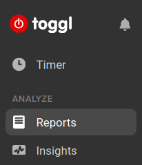
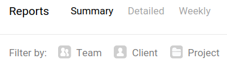

# togglore

Tool for the timetracker [toggle](http://toggl.com/) to calculate the difference between tracked time and the time you should have worked in a given range.


## Setup

Create a virtual env using python3 and install the requirements.

```sh
virtualenv --python=python3 venv
source venv/bin/activate
pip install -r requirements.txt
```

Create a config file and save it at `~/.togglore`.

```sh
[Authentication]
API_KEY = 5b9f5e3fd7745a022781daf205f62c72

[Work Hours]
hours_per_day = 8.4
excluded_days = 2016.01.01

[User Info]
id = 123123123
workspace = 123123123
project = 123123123
```

Where to find your information:

* **API_KEY**: You can find in the section "API Token" in your [profile page](https://toggl.com/app/profile).


* **id**, **workspace** and **project**: Open your reports summary in the toggl web app ([link](https://toggl.com/app/reports/summary/)). Then select a filter by Team (select your user) and by project (select the project you want to follow) as showed in the images. Copy the ids showed in the path: `https://toggl.com/app/reports/summary/<workspace_id>/period/thisWeek/projects/<project_id>/users/<user_id>`





## Running notifications

Open your crontab file (`crontab -e` in a terminal).
Then add the following line in your crontab file:

```bash
*/10 * * * * eval "export $(egrep -z DBUS_SESSION_BUS_ADDRESS /proc/$(pgrep -u $LOGNAME gnome-session)/environ)" && ~/Documents/GitHub/togglore/venv/bin/python ~/Documents/GitHub/togglore/run.py --notify today
```

This will run the script with the notify option for today. The first part of the command is used to allow the use of notifications in gnome env when a script is called by crontab.

Obs: You should add to the crontab of your user, if you insists and add this to the sudo crontab you have to fix the HOME path.

## Run

```sh
# show diff for today
python3 run.py today

# show diff for the current week
python3 run.py thisweek

# show diff for the current month
python3 run.py thismonth

# show diff for the current year
python3 run.py thisyear

# show diff for the given month
python3 run.py month 08

# show diff from 2016.08.01 until today
python3 run.py since 2016.08.01
```

The output is something like:

```text
Hours to do: 176.00h (22.00 days)
Hours worked: 186.65h (23.33 days)
Difference: 10.65h (1.33 days)
```
